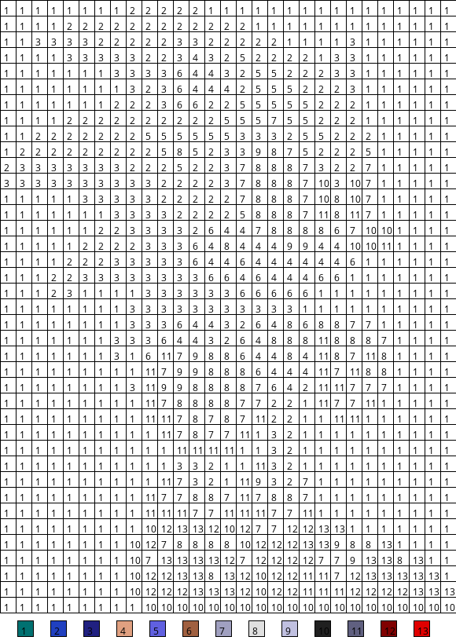

# Pynt By Numbers

https://github.com/aquova/pynt-by-numbers

"What a stupid name."

## Intro

This project allows you to turn pixel art images into "Paint-by-Number" style puzzles. Unlike some other services, the generated image will be an entire grid, including background pixels. This way, the source image can remain better hidden.

## Example




## Installation

Make sure you have Python 3 and Pip installed, then install dependencies via:

```
python3 -m pip install -r requirements.txt
```

## Usage

The program requires an input file path, the size of the grid (in pixels), and the output file path. You can also optionally specify the `--legend` flag, which will show the color key at the bottom. Without it, the colors can be a *mystery*.

```
usage: pynt-by-numbers.py [-h] [--legend] file_name grid_size out_filename

Creates Paint By Numbers image

positional arguments:
  file_name     Filename of input image
  grid_size     Grid size, in pixels
  out_filename  Filename of output image

optional arguments:
  -h, --help    show this help message and exit
  --legend      Whether to show the color legend
```

## Limitations

The program works for simple cases, but if your source image doesn't have square "pixels" or has image artifacts, the resulting output won't turn out as well. If you're using a small image, it's also best to scale it up, as the output will use the same dimensions as the source. Otherwise, the grid and text can be hard to discern.
